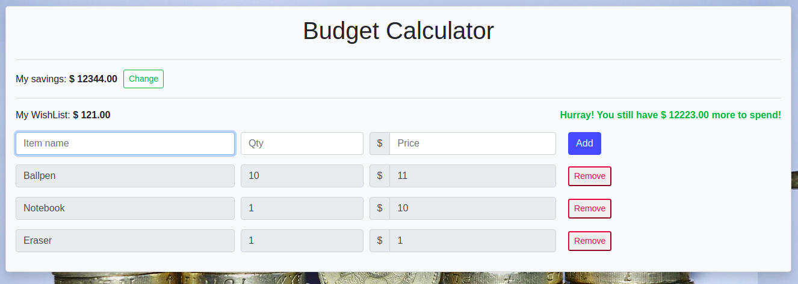

# Budget Calculator

This simple applications tells you if you can buy a list of priced items or not.

The app lets you set your current savings and generate a list of items, with quantity and price.
Overall budget is updated with every change and calculated against current savings. Then a message is shown to the user inidicating wether she can add more items to the list or if she is missing money.

Application is automatically built, tested and deployed with [GitHub Actions](https://github.com/eldocbrown/budget-calculator/actions) and can be used at this repository's [GitHub Pages](https://eldocbrown.github.io/budget-calculator/)

Tests are built with [Jest](https://jestjs.io/) and [React Test Renderer](https://reactjs.org/docs/test-renderer.html), and pipeline is set to deploy the app on +90% code coverage only, and no tests failures.

This project was bootstrapped with [Create React App](https://github.com/facebook/create-react-app).
